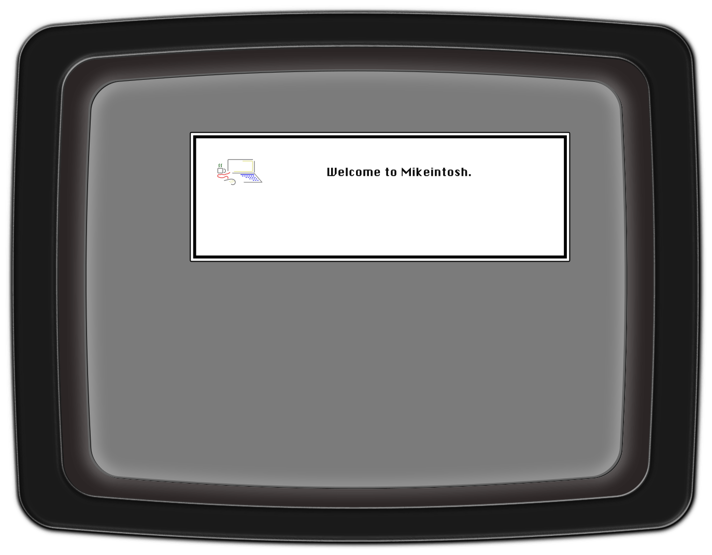

# Mikeintosh

My personal website, built in Next.js + TypeScript + MongoDB

###### 
Desktop

###### 
Mobile

## Table of Contents

- [Stack](#stack)
- [Description](#description)
- [Credits](#credits)

## Stack

- React.js
- Next.js
- TypeScript
- MongoDB
- Mongoose / Typegoose

## Description

This site was built on a React.js / Next.js stack, using the magic of server-side rendering!

The CRT effect is done in pure CSS, based on the awesome work by [Alec Lownes](http://aleclownes.com/2017/02/01/crt-display.html) and [Lucas Bebber](https://codepen.io/lbebber/pen/XJRdrV).

(If you couldn't tell, my first computer was a Mac LC III)

The projects section implements the full MERN stack. Or would it be MRNN in this case....? Either way, we've got a MongoDB database wired up via Next.js's route handling feature, with dynamic app routing for the frontend that takes advantage of Next's SSG features for minimal load times.

## Credits

### Icons

Icons by [Icons8](https://icons8.com):
- [Adobe Illustrator](https://icons8.com/icon/100522/adobe-illustrator)
- [Adobe Photoshop](https://icons8.com/icon/60629/adobe-photoshop)
- [Auth0](https://icons8.com/icon/Sx0c8V3R9jEJ/auth0-the-solution-you-need-for-web%2C-mobile%2C-iot%2C-and-internal-applications.)
- [Bomb](https://icons8.com/icon/80098/explosive)
- [CSS3](https://icons8.com/icon/38272/css3)
- [Express Js](https://icons8.com/icon/kg46nzoJrmTR/express-js)
- [HTML5](https://icons8.com/icon/23028/html-5)
- [JavaScript](https://icons8.com/icon/39854/javascript)
- [JQuery](https://icons8.com/icon/40253/jquery)
- [Kinect](https://icons8.com/icon/eKiffGnSJhqU/kinect)
- [Material Ui](https://icons8.com/icon/gFw7X5Tbl3ss/material-ui)
- [MongoDB](https://icons8.com/icon/74402/mongodb)
- [Next.js](https://icons8.com/icon/yUdJlcKanVbh/next.js)
- [PHP](https://icons8.com/icon/39856/php-logo)
- [React.js](https://icons8.com/icon/122637/react)
- [Redux](https://icons8.com/icon/A6r5yddU9uA0/redux)
- [TypeScript](https://icons8.com/icon/cHBUT9SmrD2V/typescript)
- [Unity](https://icons8.com/icon/39848/unity)
- [WordPress](https://icons8.com/icon/12510/wordpress)

date by Popular from [Noun Project](https://thenounproject.com/browse/icons/term/date/) (CC BY 3.0)
Search Settings by TkBt from [Noun Project](https://thenounproject.com/browse/icons/term/search-settings/) (CC BY 3.0)

### Fonts

- [Gelasio webfont by Google Fonts](https://fonts.google.com/specimen/Gelasio)
- [Geneva 9 webfont by Kelsey Higham](https://fonts2u.com/geneva-9-regular.font)
- [Lora webfont by Google Fonts](https://fonts.google.com/specimen/Lora)
- [Sysfont webfont by Alina Sava](https://fontsarena.com/sysfont-by-alina-sava/)

### Misc.

[Improved .sr-only styles](https://gist.github.com/ffoodd/000b59f431e3e64e4ce1a24d5bb36034) courtesy of [Gaël Poupard's](https://gist.github.com/ffoodd) hard work.

[MultiSelect React Dropdown](https://github.com/srigar/multiselect-react-dropdown) by srigar